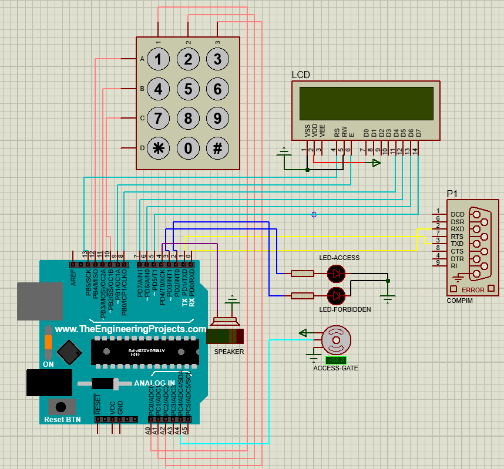

# Security System Internet of Things

## Descripción

Aplicación compuesta de un backend construido en Node.js y un frontend básico construido con HTML/CSS/JS.
Permite visualizar los reportes creados en Backend. Estos reportes indican ciertos eventos ocurridos al intentar abrir una puerta (motor servo) mediante el ingreso de una contraseña en un teclado numérico. El circuito que modela el contexto de esta aplicación fue construido usando el simulador Proteus.

Para simular un puerto serial se puede utilizar la aplicación VSPE.

## Instalación

Instalar aplicación Backend (siguiendo pasos de su respectivo README) y abrir aplicacion Frontend.

## Licencia

[MIT license](https://opensource.org/licenses/MIT).
